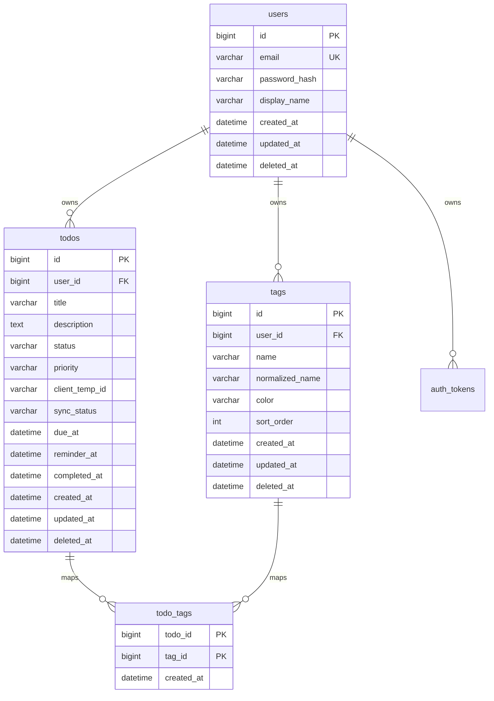

# 待办事项 App 数据库设计

版本：1.0  
日期：2026-07-01  
数据库：MySQL 8.x  
迁移工具：Flyway  
服务端访问层：MyBatis

## 1. 设计目标

本数据库设计服务于 BEGO 待办事项 App 的 MVP 版本，覆盖用户账户、待办事项、自定义标签、Access Token + Refresh Token、离线创建同步、用户注销和基础审计字段。图片附件上传功能优先级延后，附件表作为 P2 阶段预留设计，不纳入 V1 初始化迁移。

设计重点：

- 用户数据严格隔离，所有业务表保留 `user_id`。
- 支持软删除，避免误删后无法恢复。
- 标签名称支持软删除后复用。
- 待办列表查询高频路径有明确索引。
- 支持前端离线创建待办，通过客户端临时 ID 和同步状态保证幂等同步。
- 认证方案确定为 Access Token + Refresh Token，支持退出登录和刷新令牌失效。
- 支持用户注销，优先脱敏 PII 并软删除业务数据。
- 图片文件和数据库解耦方案暂缓决策，P2 阶段再确定本地存储、云存储或混合存储。
- 表结构通过 Flyway 版本化迁移，便于持续演进。

## 2. 命名规范

- 表名使用复数下划线命名，例如 `todos`、`todo_tags`。
- 字段名使用下划线命名，例如 `created_at`、`deleted_at`。
- 主键统一使用 `BIGINT UNSIGNED AUTO_INCREMENT`。
- 时间字段统一使用 `DATETIME(3)`，由服务端按 UTC 写入。
- 软删除字段统一使用 `deleted_at DATETIME(3) NULL`。
- 状态类字段使用 `VARCHAR`，不使用 MySQL `ENUM`，便于后续扩展和 Java 侧枚举映射。
- 字符集使用 `utf8mb4`，排序规则使用 `utf8mb4_0900_ai_ci`。

## 3. 逻辑 ER 关系



## 4. 表结构设计

### 4.1 users

用户账户表。

| 字段 | 类型 | 约束 | 说明 |
| --- | --- | --- | --- |
| id | BIGINT UNSIGNED | PK | 用户 ID |
| email | VARCHAR(255) | NOT NULL | 登录邮箱 |
| normalized_email | VARCHAR(255) | NOT NULL, UK | 归一化邮箱，小写并去除首尾空格 |
| password_hash | VARCHAR(255) | NOT NULL | 密码哈希 |
| display_name | VARCHAR(80) | NOT NULL | 昵称 |
| avatar_url | VARCHAR(1000) | NULL | 用户头像 URL，MVP 可暂不使用 |
| status | VARCHAR(20) | NOT NULL | `ACTIVE`、`DISABLED`、`DELETED` |
| last_login_at | DATETIME(3) | NULL | 最近登录时间 |
| deletion_requested_at | DATETIME(3) | NULL | 注销申请时间 |
| anonymized_at | DATETIME(3) | NULL | 账号脱敏完成时间 |
| created_at | DATETIME(3) | NOT NULL | 创建时间 |
| updated_at | DATETIME(3) | NOT NULL | 更新时间 |
| deleted_at | DATETIME(3) | NULL | 删除时间 |

索引：

- `uk_users_normalized_email(normalized_email)`。
- `idx_users_deleted_at(deleted_at)`。

设计说明：

- 登录时使用 `normalized_email` 查询，避免大小写邮箱重复注册。
- `status` 用于封禁、注销冷却和注销完成等场景。
- 用户注销后应将 `email`、`normalized_email`、`display_name` 等 PII 更新为不可逆脱敏值，并撤销所有令牌。

### 4.2 todos

待办事项表。

| 字段 | 类型 | 约束 | 说明 |
| --- | --- | --- | --- |
| id | BIGINT UNSIGNED | PK | 待办 ID |
| user_id | BIGINT UNSIGNED | NOT NULL, FK | 所属用户 |
| title | VARCHAR(120) | NOT NULL | 标题 |
| description | TEXT | NULL | 描述 |
| status | VARCHAR(20) | NOT NULL | `TODO`、`DONE` |
| priority | VARCHAR(20) | NOT NULL | `LOW`、`MEDIUM`、`HIGH` |
| client_temp_id | VARCHAR(64) | NULL | 客户端离线创建时生成的临时 ID |
| sync_status | VARCHAR(20) | NOT NULL | `SYNCED`、`PENDING_CREATE`、`PENDING_UPDATE`、`PENDING_DELETE`、`FAILED` |
| last_synced_at | DATETIME(3) | NULL | 最近一次同步成功时间 |
| due_at | DATETIME(3) | NULL | 截止时间 |
| reminder_at | DATETIME(3) | NULL | 提醒时间 |
| completed_at | DATETIME(3) | NULL | 完成时间 |
| sort_order | BIGINT | NOT NULL | 用户手动排序值 |
| created_at | DATETIME(3) | NOT NULL | 创建时间 |
| updated_at | DATETIME(3) | NOT NULL | 更新时间 |
| deleted_at | DATETIME(3) | NULL | 删除时间 |

索引：

- `idx_todos_user_status_due(user_id, deleted_at, status, due_at)`：列表、今天、即将到期查询。
- `idx_todos_user_updated(user_id, deleted_at, updated_at)`：最近更新排序。
- `idx_todos_user_priority(user_id, deleted_at, priority)`：优先级筛选。
- `idx_todos_user_created(user_id, deleted_at, created_at)`：创建时间排序。
- `idx_todos_reminder(reminder_at, status, deleted_at)`：提醒扫描，后续服务端推送可用。
- `uk_todos_user_client_temp(user_id, client_temp_id)`：离线创建幂等同步，MySQL 允许多个 `NULL`。
- `idx_todos_user_sync(user_id, sync_status, updated_at)`：同步状态查询。

设计说明：

- `priority` 默认 `MEDIUM`。
- `sort_order` 预留给拖拽排序；如果暂不实现，创建时可写入毫秒时间戳或 0。
- `client_temp_id` 由前端离线创建时生成，在线创建可为空。
- `sync_status` 服务端默认 `SYNCED`；离线队列同步失败时，客户端本地状态可以先标记为 `FAILED`，服务端保存该字段是为了多端同步和排障。
- 关键词搜索 MVP 可用 `LIKE`；数据量变大后再引入全文索引或搜索服务。

### 4.3 tags

用户自定义标签表。

| 字段 | 类型 | 约束 | 说明 |
| --- | --- | --- | --- |
| id | BIGINT UNSIGNED | PK | 标签 ID |
| user_id | BIGINT UNSIGNED | NOT NULL, FK | 所属用户 |
| name | VARCHAR(30) | NOT NULL | 标签展示名 |
| normalized_name | VARCHAR(30) | NOT NULL | 归一化标签名 |
| color | VARCHAR(7) | NOT NULL | 十六进制颜色 |
| sort_order | INT | NOT NULL | 排序值 |
| created_at | DATETIME(3) | NOT NULL | 创建时间 |
| updated_at | DATETIME(3) | NOT NULL | 更新时间 |
| deleted_at | DATETIME(3) | NULL | 删除时间 |
| active_key | BIGINT UNSIGNED | NOT NULL | 软删除唯一约束辅助字段 |

索引：

- `uk_tags_user_active_name(user_id, normalized_name, active_key)`。
- `idx_tags_user_sort(user_id, deleted_at, sort_order, created_at)`。

设计说明：

- MySQL 唯一索引允许多个 `NULL`，不能直接用 `(user_id, normalized_name, deleted_at)` 保证未删除标签名唯一。
- `active_key` 解决软删除唯一约束：未删除数据固定为 `0`，删除时更新为该标签 `id`。
- 这样同一用户下未删除标签名唯一，软删除后可重新创建同名标签。

### 4.4 todo_tags

待办与标签多对多关系表。

| 字段 | 类型 | 约束 | 说明 |
| --- | --- | --- | --- |
| todo_id | BIGINT UNSIGNED | PK, FK | 待办 ID |
| tag_id | BIGINT UNSIGNED | PK, FK | 标签 ID |
| user_id | BIGINT UNSIGNED | NOT NULL, FK | 所属用户 |
| created_at | DATETIME(3) | NOT NULL | 创建时间 |

索引：

- `pk_todo_tags(todo_id, tag_id)`。
- `idx_todo_tags_user_tag(user_id, tag_id, todo_id)`：按标签筛选待办。
- `idx_todo_tags_tag(tag_id)`：标签删除或统计。

设计说明：

- 冗余 `user_id` 是为了 MyBatis 查询按用户过滤更直接，也避免跨用户错误关联。
- 插入关系前服务端必须校验 `todo_id` 和 `tag_id` 均属于当前用户。

### 4.5 attachments（P2 预留）

图片附件元数据表。图片上传功能不纳入 MVP，本表不建议放入 `V1__create_initial_schema.sql`，应在存储方案确定后通过独立 Flyway 迁移引入。

| 字段 | 类型 | 约束 | 说明 |
| --- | --- | --- | --- |
| id | BIGINT UNSIGNED | PK | 附件 ID |
| user_id | BIGINT UNSIGNED | NOT NULL, FK | 所属用户 |
| todo_id | BIGINT UNSIGNED | NOT NULL, FK | 所属待办 |
| original_filename | VARCHAR(255) | NOT NULL | 原始文件名 |
| storage_provider | VARCHAR(30) | NOT NULL | `LOCAL`、`S3`、`OSS` 等 |
| storage_key | VARCHAR(500) | NOT NULL | 文件存储 Key |
| access_url | VARCHAR(1000) | NOT NULL | 原图访问 URL 或业务访问路径 |
| thumbnail_url | VARCHAR(1000) | NULL | 缩略图 URL |
| mime_type | VARCHAR(100) | NOT NULL | MIME 类型 |
| file_size | BIGINT UNSIGNED | NOT NULL | 文件大小，单位字节 |
| width | INT UNSIGNED | NULL | 图片宽度 |
| height | INT UNSIGNED | NULL | 图片高度 |
| checksum_sha256 | CHAR(64) | NULL | 文件哈希，便于去重或校验 |
| created_at | DATETIME(3) | NOT NULL | 创建时间 |
| deleted_at | DATETIME(3) | NULL | 删除时间 |

索引：

- `idx_attachments_todo(todo_id, deleted_at, created_at)`：待办详情附件列表。
- `idx_attachments_user(user_id, deleted_at, created_at)`：用户附件查询或清理。
- `idx_attachments_storage(storage_provider, storage_key)`：存储清理定位。

设计说明：

- 数据库不保存图片二进制内容。
- `access_url` 可以是 `/api/v1/attachments/{id}/content` 这类业务路径，不建议直接暴露磁盘路径。
- 软删除后物理文件可通过定时任务延迟清理。

### 4.6 auth_tokens

登录令牌表。认证方案确定为 Access Token + Refresh Token。服务端只保存令牌哈希，不保存明文令牌；退出登录、注销账号或检测到异常时可撤销相关令牌。

| 字段 | 类型 | 约束 | 说明 |
| --- | --- | --- | --- |
| id | BIGINT UNSIGNED | PK | 令牌 ID |
| user_id | BIGINT UNSIGNED | NOT NULL, FK | 所属用户 |
| token_hash | CHAR(64) | NOT NULL, UK | 令牌哈希 |
| token_type | VARCHAR(20) | NOT NULL | `ACCESS`、`REFRESH` |
| parent_token_id | BIGINT UNSIGNED | NULL | Access Token 可关联其 Refresh Token |
| device_name | VARCHAR(120) | NULL | 设备名称 |
| user_agent | VARCHAR(500) | NULL | 登录设备 UA |
| ip_address | VARCHAR(45) | NULL | 最近使用 IP，兼容 IPv6 |
| expires_at | DATETIME(3) | NOT NULL | 过期时间 |
| last_used_at | DATETIME(3) | NULL | 最近使用时间 |
| revoked_at | DATETIME(3) | NULL | 失效时间 |
| created_at | DATETIME(3) | NOT NULL | 创建时间 |

索引：

- `uk_auth_tokens_token_hash(token_hash)`。
- `idx_auth_tokens_user(user_id, revoked_at, expires_at)`。
- `idx_auth_tokens_parent(parent_token_id)`。

设计说明：

- 表内只保存令牌哈希，不保存明文令牌。
- Access Token 建议短有效期；Refresh Token 建议长有效期并支持轮换。
- 刷新令牌时可撤销旧 Refresh Token 并签发新 Refresh Token。
- 退出登录时更新当前设备相关令牌的 `revoked_at`。
- 用户注销时撤销该用户全部令牌。

## 5. 推荐初始化 DDL

以下 DDL 可作为 `V1__create_initial_schema.sql` 的基础。V1 不创建附件表，避免在图片存储方案未确定前固化表结构和接口边界。

```sql
CREATE TABLE users (
    id BIGINT UNSIGNED NOT NULL AUTO_INCREMENT,
    email VARCHAR(255) NOT NULL,
    normalized_email VARCHAR(255) NOT NULL,
    password_hash VARCHAR(255) NOT NULL,
    display_name VARCHAR(80) NOT NULL,
    avatar_url VARCHAR(1000) NULL,
    status VARCHAR(20) NOT NULL DEFAULT 'ACTIVE',
    last_login_at DATETIME(3) NULL,
    deletion_requested_at DATETIME(3) NULL,
    anonymized_at DATETIME(3) NULL,
    created_at DATETIME(3) NOT NULL DEFAULT CURRENT_TIMESTAMP(3),
    updated_at DATETIME(3) NOT NULL DEFAULT CURRENT_TIMESTAMP(3) ON UPDATE CURRENT_TIMESTAMP(3),
    deleted_at DATETIME(3) NULL,
    PRIMARY KEY (id),
    UNIQUE KEY uk_users_normalized_email (normalized_email),
    KEY idx_users_deleted_at (deleted_at),
    CONSTRAINT chk_users_status CHECK (status IN ('ACTIVE', 'DISABLED', 'DELETED'))
) ENGINE=InnoDB DEFAULT CHARSET=utf8mb4 COLLATE=utf8mb4_0900_ai_ci;

CREATE TABLE todos (
    id BIGINT UNSIGNED NOT NULL AUTO_INCREMENT,
    user_id BIGINT UNSIGNED NOT NULL,
    title VARCHAR(120) NOT NULL,
    description TEXT NULL,
    status VARCHAR(20) NOT NULL DEFAULT 'TODO',
    priority VARCHAR(20) NOT NULL DEFAULT 'MEDIUM',
    client_temp_id VARCHAR(64) NULL,
    sync_status VARCHAR(20) NOT NULL DEFAULT 'SYNCED',
    last_synced_at DATETIME(3) NULL,
    due_at DATETIME(3) NULL,
    reminder_at DATETIME(3) NULL,
    completed_at DATETIME(3) NULL,
    sort_order BIGINT NOT NULL DEFAULT 0,
    created_at DATETIME(3) NOT NULL DEFAULT CURRENT_TIMESTAMP(3),
    updated_at DATETIME(3) NOT NULL DEFAULT CURRENT_TIMESTAMP(3) ON UPDATE CURRENT_TIMESTAMP(3),
    deleted_at DATETIME(3) NULL,
    PRIMARY KEY (id),
    KEY idx_todos_user_status_due (user_id, deleted_at, status, due_at),
    KEY idx_todos_user_updated (user_id, deleted_at, updated_at),
    KEY idx_todos_user_priority (user_id, deleted_at, priority),
    KEY idx_todos_user_created (user_id, deleted_at, created_at),
    KEY idx_todos_reminder (reminder_at, status, deleted_at),
    UNIQUE KEY uk_todos_user_client_temp (user_id, client_temp_id),
    KEY idx_todos_user_sync (user_id, sync_status, updated_at),
    CONSTRAINT fk_todos_user FOREIGN KEY (user_id) REFERENCES users (id),
    CONSTRAINT chk_todos_status CHECK (status IN ('TODO', 'DONE')),
    CONSTRAINT chk_todos_priority CHECK (priority IN ('LOW', 'MEDIUM', 'HIGH')),
    CONSTRAINT chk_todos_sync_status CHECK (sync_status IN ('SYNCED', 'PENDING_CREATE', 'PENDING_UPDATE', 'PENDING_DELETE', 'FAILED'))
) ENGINE=InnoDB DEFAULT CHARSET=utf8mb4 COLLATE=utf8mb4_0900_ai_ci;

CREATE TABLE tags (
    id BIGINT UNSIGNED NOT NULL AUTO_INCREMENT,
    user_id BIGINT UNSIGNED NOT NULL,
    name VARCHAR(30) NOT NULL,
    normalized_name VARCHAR(30) NOT NULL,
    color VARCHAR(7) NOT NULL DEFAULT '#2F80ED',
    sort_order INT NOT NULL DEFAULT 0,
    created_at DATETIME(3) NOT NULL DEFAULT CURRENT_TIMESTAMP(3),
    updated_at DATETIME(3) NOT NULL DEFAULT CURRENT_TIMESTAMP(3) ON UPDATE CURRENT_TIMESTAMP(3),
    deleted_at DATETIME(3) NULL,
    active_key BIGINT UNSIGNED NOT NULL DEFAULT 0,
    PRIMARY KEY (id),
    UNIQUE KEY uk_tags_user_active_name (user_id, normalized_name, active_key),
    KEY idx_tags_user_sort (user_id, deleted_at, sort_order, created_at),
    CONSTRAINT fk_tags_user FOREIGN KEY (user_id) REFERENCES users (id),
    CONSTRAINT chk_tags_color CHECK (color REGEXP '^#[0-9A-Fa-f]{6}$')
) ENGINE=InnoDB DEFAULT CHARSET=utf8mb4 COLLATE=utf8mb4_0900_ai_ci;

CREATE TABLE todo_tags (
    todo_id BIGINT UNSIGNED NOT NULL,
    tag_id BIGINT UNSIGNED NOT NULL,
    user_id BIGINT UNSIGNED NOT NULL,
    created_at DATETIME(3) NOT NULL DEFAULT CURRENT_TIMESTAMP(3),
    PRIMARY KEY (todo_id, tag_id),
    KEY idx_todo_tags_user_tag (user_id, tag_id, todo_id),
    KEY idx_todo_tags_tag (tag_id),
    CONSTRAINT fk_todo_tags_todo FOREIGN KEY (todo_id) REFERENCES todos (id),
    CONSTRAINT fk_todo_tags_tag FOREIGN KEY (tag_id) REFERENCES tags (id),
    CONSTRAINT fk_todo_tags_user FOREIGN KEY (user_id) REFERENCES users (id)
) ENGINE=InnoDB DEFAULT CHARSET=utf8mb4 COLLATE=utf8mb4_0900_ai_ci;

CREATE TABLE auth_tokens (
    id BIGINT UNSIGNED NOT NULL AUTO_INCREMENT,
    user_id BIGINT UNSIGNED NOT NULL,
    token_hash CHAR(64) NOT NULL,
    token_type VARCHAR(20) NOT NULL,
    parent_token_id BIGINT UNSIGNED NULL,
    device_name VARCHAR(120) NULL,
    user_agent VARCHAR(500) NULL,
    ip_address VARCHAR(45) NULL,
    expires_at DATETIME(3) NOT NULL,
    last_used_at DATETIME(3) NULL,
    revoked_at DATETIME(3) NULL,
    created_at DATETIME(3) NOT NULL DEFAULT CURRENT_TIMESTAMP(3),
    PRIMARY KEY (id),
    UNIQUE KEY uk_auth_tokens_token_hash (token_hash),
    KEY idx_auth_tokens_user (user_id, revoked_at, expires_at),
    KEY idx_auth_tokens_parent (parent_token_id),
    CONSTRAINT fk_auth_tokens_user FOREIGN KEY (user_id) REFERENCES users (id),
    CONSTRAINT fk_auth_tokens_parent FOREIGN KEY (parent_token_id) REFERENCES auth_tokens (id),
    CONSTRAINT chk_auth_tokens_type CHECK (token_type IN ('ACCESS', 'REFRESH'))
) ENGINE=InnoDB DEFAULT CHARSET=utf8mb4 COLLATE=utf8mb4_0900_ai_ci;
```

## 6. P2 附件迁移草案

### 6.1 附件表

图片存储方案确定后，可新增独立迁移脚本，例如 `V5__add_attachments.sql`。以下 DDL 仅作为 P2 草案，不进入 V1：

```sql
CREATE TABLE attachments (
    id BIGINT UNSIGNED NOT NULL AUTO_INCREMENT,
    user_id BIGINT UNSIGNED NOT NULL,
    todo_id BIGINT UNSIGNED NOT NULL,
    original_filename VARCHAR(255) NOT NULL,
    storage_provider VARCHAR(30) NOT NULL,
    storage_key VARCHAR(500) NOT NULL,
    access_url VARCHAR(1000) NOT NULL,
    thumbnail_url VARCHAR(1000) NULL,
    mime_type VARCHAR(100) NOT NULL,
    file_size BIGINT UNSIGNED NOT NULL,
    width INT UNSIGNED NULL,
    height INT UNSIGNED NULL,
    checksum_sha256 CHAR(64) NULL,
    created_at DATETIME(3) NOT NULL DEFAULT CURRENT_TIMESTAMP(3),
    deleted_at DATETIME(3) NULL,
    PRIMARY KEY (id),
    KEY idx_attachments_todo (todo_id, deleted_at, created_at),
    KEY idx_attachments_user (user_id, deleted_at, created_at),
    KEY idx_attachments_storage (storage_provider, storage_key),
    CONSTRAINT fk_attachments_user FOREIGN KEY (user_id) REFERENCES users (id),
    CONSTRAINT fk_attachments_todo FOREIGN KEY (todo_id) REFERENCES todos (id)
) ENGINE=InnoDB DEFAULT CHARSET=utf8mb4 COLLATE=utf8mb4_0900_ai_ci;
```

## 7. 常用查询设计

### 7.1 待办列表

典型条件：

```sql
SELECT *
FROM todos
WHERE user_id = ?
  AND deleted_at IS NULL
  AND (? IS NULL OR status = ?)
  AND (? IS NULL OR priority = ?)
  AND (? IS NULL OR (title LIKE ? OR description LIKE ?))
ORDER BY
  CASE WHEN status = 'TODO' THEN 0 ELSE 1 END,
  CASE WHEN due_at IS NULL THEN 1 ELSE 0 END,
  due_at ASC,
  updated_at DESC
LIMIT ? OFFSET ?;
```

说明：

- 关键词搜索会降低索引利用率，MVP 可接受。
- 如果搜索成为高频能力，建议增加 MySQL FULLTEXT 索引或外部搜索服务。

### 7.2 离线创建待办同步

前端离线创建待办时先生成 `client_temp_id`。网络恢复后提交到后端，后端按 `(user_id, client_temp_id)` 做幂等处理。

```sql
SELECT id
FROM todos
WHERE user_id = ?
  AND client_temp_id = ?
  AND deleted_at IS NULL;
```

如果存在记录，返回已有待办；如果不存在，创建新待办：

```sql
INSERT INTO todos (
    user_id,
    title,
    description,
    status,
    priority,
    client_temp_id,
    sync_status,
    last_synced_at,
    due_at,
    reminder_at
) VALUES (?, ?, ?, 'TODO', ?, ?, 'SYNCED', CURRENT_TIMESTAMP(3), ?, ?);
```

### 7.3 按标签筛选待办

```sql
SELECT t.*
FROM todos t
JOIN todo_tags tt ON tt.todo_id = t.id
WHERE t.user_id = ?
  AND t.deleted_at IS NULL
  AND tt.user_id = ?
  AND tt.tag_id = ?
ORDER BY t.updated_at DESC
LIMIT ? OFFSET ?;
```

### 7.4 标签列表和未完成数量

```sql
SELECT
    tg.id,
    tg.name,
    tg.color,
    tg.sort_order,
    COUNT(td.id) AS active_todo_count
FROM tags tg
LEFT JOIN todo_tags tt
    ON tt.tag_id = tg.id
LEFT JOIN todos td
    ON td.id = tt.todo_id
   AND td.status = 'TODO'
   AND td.deleted_at IS NULL
WHERE tg.user_id = ?
  AND tg.deleted_at IS NULL
GROUP BY tg.id, tg.name, tg.color, tg.sort_order
ORDER BY tg.sort_order ASC, tg.created_at ASC;
```

### 7.5 Access Token + Refresh Token

登录成功：

- 签发短有效期 Access Token。
- 签发长有效期 Refresh Token。
- 两者都只保存 SHA-256 哈希。
- Access Token 的 `parent_token_id` 指向对应 Refresh Token。

刷新令牌：

```sql
SELECT *
FROM auth_tokens
WHERE token_hash = ?
  AND token_type = 'REFRESH'
  AND revoked_at IS NULL
  AND expires_at > CURRENT_TIMESTAMP(3);
```

刷新成功后建议轮换 Refresh Token：

```sql
UPDATE auth_tokens
SET revoked_at = CURRENT_TIMESTAMP(3),
    last_used_at = CURRENT_TIMESTAMP(3)
WHERE id = ?
  AND token_type = 'REFRESH'
  AND revoked_at IS NULL;
```

退出登录时撤销当前设备的 Access Token 和 Refresh Token；用户注销时撤销该用户全部令牌。

## 8. 软删除策略

### 8.1 普通业务表

删除时只更新 `deleted_at`，查询默认附加 `deleted_at IS NULL`。

```sql
UPDATE todos
SET deleted_at = CURRENT_TIMESTAMP(3),
    updated_at = CURRENT_TIMESTAMP(3)
WHERE id = ?
  AND user_id = ?
  AND deleted_at IS NULL;
```

### 8.2 标签软删除和唯一约束

删除标签时需要同时更新 `active_key`：

```sql
UPDATE tags
SET deleted_at = CURRENT_TIMESTAMP(3),
    active_key = id,
    updated_at = CURRENT_TIMESTAMP(3)
WHERE id = ?
  AND user_id = ?
  AND deleted_at IS NULL;
```

创建或恢复未删除标签时，`active_key` 必须为 `0`。

### 8.3 用户注销和数据脱敏

用户注销采用“账号脱敏 + 业务数据软删除 + 令牌撤销”的策略，避免保留可识别个人信息，同时保留必要审计结构。

建议流程：

1. 校验用户身份，例如要求重新输入密码或二次确认。
2. 将用户状态改为 `DELETED`。
3. 将 `email`、`normalized_email`、`display_name`、`avatar_url` 更新为不可逆脱敏值。
4. 更新 `deletion_requested_at`、`anonymized_at`、`deleted_at`。
5. 软删除该用户的待办和标签。
6. 撤销该用户全部 Access Token 和 Refresh Token。

示例：

```sql
UPDATE users
SET email = CONCAT('deleted+', id, '@deleted.local'),
    normalized_email = CONCAT('deleted+', id, '@deleted.local'),
    display_name = '已注销用户',
    avatar_url = NULL,
    status = 'DELETED',
    deletion_requested_at = CURRENT_TIMESTAMP(3),
    anonymized_at = CURRENT_TIMESTAMP(3),
    deleted_at = CURRENT_TIMESTAMP(3),
    updated_at = CURRENT_TIMESTAMP(3)
WHERE id = ?
  AND deleted_at IS NULL;

UPDATE todos
SET deleted_at = CURRENT_TIMESTAMP(3),
    updated_at = CURRENT_TIMESTAMP(3)
WHERE user_id = ?
  AND deleted_at IS NULL;

UPDATE tags
SET deleted_at = CURRENT_TIMESTAMP(3),
    active_key = id,
    updated_at = CURRENT_TIMESTAMP(3)
WHERE user_id = ?
  AND deleted_at IS NULL;

UPDATE auth_tokens
SET revoked_at = CURRENT_TIMESTAMP(3)
WHERE user_id = ?
  AND revoked_at IS NULL;
```

## 9. 数据完整性规则

- `todos.user_id` 必须存在于 `users.id`。
- `todos.client_temp_id` 在同一用户下唯一；为空表示服务端在线创建或无需离线幂等。
- `todos.sync_status` 默认 `SYNCED`；服务端接收离线创建后也应落为 `SYNCED`。
- `tags.user_id` 必须存在于 `users.id`。
- P2 附件表引入后，`attachments.todo_id` 必须属于同一个 `user_id`，该规则由服务端校验，数据库外键无法直接表达跨表同用户约束。
- `todo_tags.todo_id` 与 `todo_tags.tag_id` 必须属于同一个用户，该规则由服务端校验。
- 删除用户时不做级联物理删除，采用账号脱敏、业务数据软删除和令牌撤销。
- P2 附件表引入后，删除待办时不物理删除附件，仅隐藏并等待清理任务。

## 10. MyBatis 映射建议

- Java 实体字段使用驼峰命名，开启 `mapUnderscoreToCamelCase=true`。
- 插入时由数据库生成主键，Mapper 使用 `useGeneratedKeys=true`。
- 时间类型建议使用 `java.time.Instant` 或 `OffsetDateTime`，统一转换为 UTC。
- 动态筛选使用 MyBatis XML `<where>` 和 `<if>`，避免字符串拼接 SQL。
- 批量更新待办标签建议使用事务：先删除旧关系，再批量插入新关系。

## 11. Flyway 版本规划

建议迁移脚本拆分：

| 版本 | 文件名 | 内容 |
| --- | --- | --- |
| V1 | `V1__create_initial_schema.sql` | 创建用户、待办、标签、关系、令牌表 |
| V2 | `V2__add_todo_fulltext_index.sql` | 如需要，增加待办全文索引 |
| V3 | `V3__add_recurring_todos.sql` | 后续循环任务扩展 |
| V4 | `V4__add_subtasks.sql` | 后续子任务扩展 |
| V5 | `V5__add_attachments.sql` | P2 阶段图片上传确定后再创建附件表 |

注意：

- 已执行到共享环境的 migration 不允许修改。
- 新增字段优先允许为空或提供默认值，避免线上迁移失败。
- 大表加索引需要评估执行时间，必要时拆分迁移窗口。

## 12. 可扩展点

- 子任务：新增 `todo_items` 或 `subtasks` 表。
- 循环任务：新增 `recurrence_rule` 字段或独立 `todo_recurrences` 表。
- 多设备同步：在现有 `client_temp_id`、`sync_status` 基础上增加 `version` 或操作日志表。
- 图片上传和多规格缩略图：新增 `attachments`、`attachment_variants` 表。
- 团队协作：引入 `workspaces`、`workspace_members`，并调整业务表归属关系。

## 13. 已确认决策与保留项

- 认证方案使用 Access Token + Refresh Token。
- 前端需要离线创建待办功能，V1 在 `todos` 中增加 `client_temp_id`、`sync_status`、`last_synced_at`。
- 需要用户注销功能，V1 在 `users` 中增加注销和脱敏字段，并规定业务数据软删除与令牌撤销策略。
- 图片存储方案仍保留到 P2 阶段确认，不进入 V1 初始化迁移。
