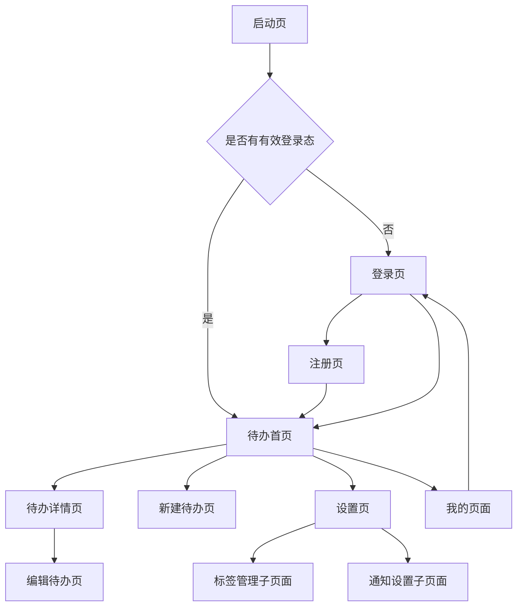

# 待办事项 App 前端设计文档

版本：1.0  
日期：2026-07-01  
项目代号：BEGO  
客户端技术栈：Flutter  
对应需求文档：`docs/SRS.md`  

## 1. 设计目标

本前端设计文档定义 BEGO 待办事项 App 的 Flutter 客户端信息架构、页面流程、模块划分、状态管理、接口对接、交互规范和测试策略。

MVP 前端目标：

- 支持用户注册、登录和登录态恢复。
- 支持待办事项创建、列表、详情、编辑、完成、删除。
- 支持自定义标签创建、编辑、删除、排序和筛选。
- 支持关键词搜索、状态筛选、优先级筛选、标签筛选。
- 支持提醒字段设置和测试版本地通知能力。
- 支持 Flutter Web 首版访问。
- 图片上传、图片预览和附件管理为 P2，MVP 不实现，只保留扩展入口。

## 2. 产品体验原则

- 快速记录：用户打开首页后，应能在最短路径内新增待办。
- 清晰扫描：列表优先展示标题、状态、标签、优先级和截止时间，减少装饰性元素。
- 低干扰：完成、删除、筛选等操作明确但不抢主任务注意力。
- 可恢复：网络失败、表单提交失败时不丢失用户输入。
- 一致性：移动端导航、表单、弹窗、筛选控件保持统一样式和行为。

## 3. 优先级范围

| 优先级 | 前端范围 |
| --- | --- |
| P0 | 登录注册、待办 CRUD、标签 CRUD、首页列表、基础筛选、错误提示、Flutter Web 首版支持。 |
| P1 | 退出登录、提醒时间、测试版本地通知、关键词搜索、组合筛选、标签排序、离线创建待办。 |
| P2 | 图片上传、图片预览、附件删除、缩略图、云存储相关配置。 |

## 4. 信息架构



导航模式：

- MVP 不使用底部导航栏。
- 首页右上角提供设置图标，点击进入设置页。
- 首页右上角提供个人头像，点击进入“我的”页面。
- 新增待办使用右下角加号悬浮按钮。
- 标签管理合并到设置页，作为设置页子页面存在。

## 5. 页面设计

### 5.1 启动页

职责：

- 初始化主题、路由、持久化存储。
- 读取本地 token。
- 判断进入登录页或待办首页。

状态：

- 加载中：显示 App 名称和加载指示。
- 登录态有效：进入首页。
- 登录态缺失或失效：进入登录页。

### 5.2 登录页

字段：

| 字段 | 规则 |
| --- | --- |
| 邮箱 | 必填，邮箱格式校验。 |
| 密码 | 必填，至少 8 位。 |

交互：

- 登录按钮在表单合法前不可提交或提交时显示字段错误。
- 登录中显示按钮 loading，避免重复提交。
- 登录失败显示统一错误提示。
- 提供跳转注册页入口。

接口：

- `POST /api/v1/auth/login`

### 5.3 注册页

字段：

| 字段 | 规则 |
| --- | --- |
| 昵称 | 必填，1-80 个字符。 |
| 邮箱 | 必填，邮箱格式校验。 |
| 密码 | 必填，至少 8 位。 |
| 确认密码 | 必须与密码一致。 |

交互：

- 注册成功后保存 token 并进入首页。
- 邮箱重复时在邮箱输入框附近展示错误。

接口：

- `POST /api/v1/auth/register`

### 5.4 待办首页

核心区域：

- 顶部：搜索入口、设置入口、头像。
- 快捷筛选：全部、今天、即将到期、已完成。
- 高级筛选：状态、优先级、标签、截止时间范围。
- 列表：待办卡片。
- 新增按钮：右下角加号悬浮按钮。

顶部入口：

| 入口 | 图标 | 目标 |
| --- | --- | --- |
| 搜索 | 放大镜 | 展开搜索或进入搜索状态。 |
| 设置 | 齿轮 | 设置页。 |
| 我的 | 个人头像 | 我的页面。 |

列表项展示：

| 元素 | 说明 |
| --- | --- |
| 完成勾选框 | 点击后完成或取消完成。 |
| 标题 | 单行或两行展示，超出省略。 |
| 标签 | 彩色小标签，最多展示 3 个，超出显示数量。 |
| 优先级 | 高优先级使用明显但克制的标识。 |
| 截止时间 | 逾期、今天、未来时间使用不同文本颜色。 |

空状态：

- 无待办：提示创建第一条待办，提供新增按钮。
- 筛选无结果：提示调整筛选条件，提供清空筛选按钮。
- 网络失败：显示重试按钮。

接口：

- `GET /api/v1/todos`
- `PATCH /api/v1/todos/{id}/status`
- `DELETE /api/v1/todos/{id}`
- `GET /api/v1/tags`

### 5.5 待办详情页

展示内容：

- 标题。
- 完成状态。
- 描述。
- 优先级。
- 截止时间。
- 提醒时间。
- 标签。
- 创建时间、更新时间、完成时间。

操作：

- 编辑。
- 完成或取消完成。
- 删除。

P2 预留：

- 附件区域暂不展示。
- 后续可在描述和元信息之间增加图片缩略图网格。

接口：

- `GET /api/v1/todos/{id}`
- `PATCH /api/v1/todos/{id}/status`
- `DELETE /api/v1/todos/{id}`

### 5.6 新建和编辑待办页

字段：

| 字段 | 类型 | 优先级 | 规则 |
| --- | --- | --- | --- |
| 标题 | 文本输入 | P0 | 必填，1-120 个字符。 |
| 描述 | 多行文本 | P0 | 选填，最多 5000 个字符。 |
| 优先级 | 分段选择 | P0 | 低、中、高，默认中。 |
| 截止时间 | 日期时间选择器 | P0 | 选填。 |
| 标签 | 多选 | P0 | 选填，仅可选择当前用户标签。 |
| 提醒时间 | 日期时间选择器 | P1 | 选填。 |
| 图片附件 | 图片选择器 | P2 | MVP 展示禁用占位。 |

交互：

- 未保存离开时，如果表单有改动，弹出确认。
- 保存成功后返回详情页或首页并刷新列表。
- 保存失败保留表单内容。
- 标签可在选择器内快速新建。

接口：

- `POST /api/v1/todos`
- `PUT /api/v1/todos/{id}`
- `GET /api/v1/tags`
- `POST /api/v1/tags`

### 5.7 设置页

设置页作为应用配置入口，不承载个人资料主信息。

MVP 内容：

- 标签管理入口。
- 通知设置入口。
- 主题设置入口，测试版可暂不实现具体切换。
- App 版本信息。

子页面：

| 子页面 | 说明 |
| --- | --- |
| 标签管理 | 创建、编辑、删除、排序标签。 |
| 通知设置 | 查看通知权限状态，测试版支持提醒通知。 |

### 5.8 标签管理子页面

功能：

- 展示标签列表。
- 创建标签。
- 编辑标签名称和颜色。
- 删除标签。
- 调整排序。

标签项展示：

| 元素 | 说明 |
| --- | --- |
| 颜色圆点 | 显示标签颜色。 |
| 名称 | 标签名称。 |
| 未完成数量 | 后端返回的未完成待办数量。 |
| 操作入口 | 编辑、删除。 |

交互：

- 删除标签前二次确认。
- 删除标签不删除待办。
- 标签名称重复时展示后端错误。

接口：

- `GET /api/v1/tags`
- `POST /api/v1/tags`
- `PUT /api/v1/tags/{id}`
- `DELETE /api/v1/tags/{id}`
- `PUT /api/v1/tags/reorder`

### 5.9 我的页面

MVP 内容：

- 当前用户邮箱和昵称。
- 用户头像占位。
- 退出登录。
- 注销账号入口。

P1/P2 扩展：

- 图片存储相关说明或开关不在客户端 MVP 中出现。

接口：

- `GET /api/v1/me`
- `POST /api/v1/auth/logout`
- `DELETE /api/v1/me`

## 6. 视觉与交互规范

### 6.1 视觉风格

定位：安静、清晰、柔和、效率工具感。避免过重装饰，简约至上，优先保证列表扫描效率。

推荐色彩：

| 用途 | 建议 |
| --- | --- |
| 主色 | 稳定蓝或青绿色，用于主要按钮、选中状态。 |
| 成功 | 绿色，用于完成状态。 |
| 警告 | 橙色，用于即将到期。 |
| 危险 | 红色，用于删除和逾期。 |
| 背景 | 浅灰或系统背景色。 |

标签颜色：

- 用户自定义色值来自后端。
- 标签文字需要根据背景色自动选择深色或浅色，保证可读性。
- 默认标签色使用 `#2F80ED`。

### 6.2 控件规范

- 新增待办使用 `FloatingActionButton`。
- 状态筛选使用分段控件或横向 chips。
- 标签筛选使用可多选 chips。
- 优先级选择使用分段控件。
- 日期时间使用系统日期时间选择器。
- 删除操作使用确认弹窗。
- 成功提示使用短时 snackbar。
- 长列表使用下拉刷新和分页加载。

### 6.3 响应式

MVP 支持移动端竖屏和 Flutter Web 首版：

- 手机宽度下使用单列布局。
- Web、平板或桌面宽度下可扩展为列表详情双栏。
- 表单内容宽屏最大宽度建议限制在 720 px。
- Web 首版以功能可用为目标，不要求达到生产发布级浏览器兼容矩阵。

## 7. 前端架构

### 7.1 推荐目录结构

```text
frontend/lib/
  main.dart
  app/
    app.dart
    router.dart
    theme.dart
  core/
    api/
      api_client.dart
      api_error.dart
      auth_interceptor.dart
    storage/
      token_storage.dart
    utils/
      datetime_formatter.dart
      validators.dart
  features/
    auth/
      data/
      domain/
      presentation/
    todos/
      data/
      domain/
      presentation/
    tags/
      data/
      domain/
      presentation/
    settings/
      presentation/
  shared/
    widgets/
    models/
```

### 7.2 分层职责

| 层 | 职责 |
| --- | --- |
| presentation | 页面、组件、表单、交互状态。 |
| domain | 业务模型、用例、枚举。 |
| data | API DTO、Repository 实现、远程数据源。 |
| core | API 客户端、认证、存储、工具。 |
| shared | 跨模块复用组件。 |

### 7.3 推荐依赖

当前项目依赖很少。进入实现阶段时建议评估以下依赖：

| 能力 | 推荐 |
| --- | --- |
| 路由 | `go_router` |
| 状态管理 | `flutter_riverpod` |
| HTTP | `dio` |
| 本地安全存储 | `flutter_secure_storage` |
| JSON 序列化 | `json_serializable` |
| 不可变模型 | `freezed`，也可先手写模型降低复杂度 |
| 日期格式化 | `intl` |
| 本地通知 | `flutter_local_notifications`，测试版 P1 |
| 图片选择 | `image_picker`，P2 |

MVP 状态管理确定采用 Riverpod。所有全局状态、列表状态和表单提交状态应通过 Provider/Notifier 管理，避免在页面 Widget 中堆叠复杂业务逻辑。

## 8. 状态管理设计

### 8.1 全局状态

| 状态 | 内容 |
| --- | --- |
| AuthState | token、当前用户、认证状态。 |
| TodoListState | 当前列表、分页信息、筛选条件、加载状态。 |
| TodoSyncState | 离线创建队列、同步中状态、同步失败记录。 |
| TagState | 标签列表、标签统计、加载状态。 |
| AppSettingsState | 主题、通知权限等。 |

### 8.2 页面状态

所有异步页面建议统一表达：

```text
idle -> loading -> success
idle -> loading -> failure
success -> refreshing -> success
success -> loadingMore -> success
```

错误状态包含：

- 网络不可用。
- 未认证或 token 过期。
- 参数校验错误。
- 服务端异常。

### 8.3 数据刷新规则

- 新建待办成功后刷新首页列表。
- 离线创建待办时先写入本地队列并在首页展示“待同步”状态。
- 网络恢复后自动同步离线创建的待办，同步成功后用服务端 ID 替换客户端临时 ID。
- 编辑待办成功后刷新详情和列表缓存。
- 完成状态切换成功后先乐观更新，失败时回滚。
- 删除待办成功后从列表移除。
- 标签变更成功后刷新标签列表和待办列表中的标签展示。

## 9. API 对接设计

### 9.1 API Client

职责：

- 统一设置 `baseUrl`。
- 自动附加 `Authorization: Bearer <token>`。
- Access Token 过期时使用 Refresh Token 静默刷新。
- 统一解析错误响应。
- Refresh Token 失效时清理登录态并跳转登录页。

### 9.2 DTO 与领域模型

建议区分 API DTO 和 UI 模型：

- DTO 负责 JSON 序列化，与后端字段保持一致。
- Domain Model 负责 App 内部使用，字段可更贴合 UI。
- Mapper 负责 DTO 到 Domain Model 的转换。

### 9.3 时间处理

- 后端返回 ISO 8601 时间。
- 客户端解析为本地 `DateTime` 后展示。
- 提交给后端时统一转为 UTC ISO 8601。
- 首页展示使用相对友好文本，例如“今天 18:00”、“明天”、“已逾期”。

## 10. 本地存储

MVP 存储内容：

| 数据 | 存储方式 |
| --- | --- |
| access token | 安全存储。 |
| refresh token | 安全存储。 |
| 离线待办创建队列 | 普通本地数据库或持久化存储，需包含客户端临时 ID。 |
| 最近筛选条件 | 普通本地存储，可选。 |
| 主题设置 | 普通本地存储，可选。 |

不在本地长期存储密码。

## 11. 表单校验

### 11.1 待办表单

| 字段 | 客户端校验 |
| --- | --- |
| 标题 | 必填，最多 120 个字符。 |
| 描述 | 最多 5000 个字符。 |
| 截止时间 | 可为空。 |
| 提醒时间 | 可为空；如设置截止时间，建议提醒时间不晚于截止时间。 |

### 11.2 标签表单

| 字段 | 客户端校验 |
| --- | --- |
| 名称 | 必填，最多 30 个字符。 |
| 颜色 | 必须是合法十六进制颜色。 |

### 11.3 认证表单

| 字段 | 客户端校验 |
| --- | --- |
| 邮箱 | 必填，邮箱格式。 |
| 密码 | 必填，至少 8 位。 |
| 确认密码 | 注册时必须与密码一致。 |

## 12. 错误处理

| 场景 | 前端行为 |
| --- | --- |
| 401 | 清理登录态，跳转登录页。 |
| 403 | 展示无权限提示。 |
| 404 | 待办详情展示不存在或已删除。 |
| 409 | 展示冲突错误，例如标签名称重复。 |
| 422/400 | 将字段错误映射到表单。 |
| 500 | 展示服务异常和重试入口。 |
| 网络超时 | 展示网络异常和重试入口。 |

错误文案应短、清楚、可操作，避免暴露服务端内部信息。

## 13. 本地通知设计（P1，测试版）

本地通知进入首个可运行测试版，但当前版本不要求达到正式发布规格。测试版需要验证基本提醒链路，后续发布版再补齐权限说明、平台差异处理和完整异常兜底。

设计要求：

- 首次设置提醒时申请通知权限。
- 用户更新提醒后取消旧通知并创建新通知。
- 用户完成或删除待办后取消对应通知。
- 通知点击后打开待办详情页。

限制：

- Web 首版不强制实现本地通知。
- Android/iOS 通知权限和后台限制先按测试版处理。
- 测试版允许存在平台能力差异，但必须在设置页显示通知状态。

## 14. 图片功能预留（P2）

图片功能暂不进入 MVP。前端不应在 P0/P1 流程中要求图片上传。

P2 需要补充：

- 图片选择器。
- 上传进度。
- 上传失败重试。
- 待办详情图片缩略图网格。
- 图片预览页。
- 删除图片二次确认。
- 图片权限说明。

P2 前端依赖可能包括：

- `image_picker`
- `photo_view`
- `cached_network_image`

## 15. 测试策略

### 15.1 单元测试

- 表单校验函数。
- DTO 与领域模型转换。
- 时间格式化。
- 筛选条件构造。

### 15.2 Widget 测试

- 登录表单错误提示。
- 待办列表空状态、加载状态、错误状态。
- 待办表单标题必填。
- 标签管理删除确认。

### 15.3 集成测试

MVP 主路径：

1. 注册或登录。
2. 创建标签。
3. 创建待办并关联标签。
4. 在首页筛选标签。
5. 标记待办完成。
6. 删除待办。
7. 退出登录。

离线创建补充路径：

1. 断网。
2. 创建待办。
3. 首页出现待同步标识。
4. 恢复网络。
5. 待办自动同步并清除待同步标识。

## 16. 实施顺序建议

1. 清理 Flutter 默认计数器页面，建立 `app/`、`core/`、`features/` 目录。
2. 接入路由、主题和认证状态骨架。
3. 实现登录、注册和 token 存储。
4. 实现待办列表和待办详情。
5. 实现新建、编辑、完成、删除待办。
6. 实现设置页和标签管理子页面。
7. 实现关键词搜索、组合筛选和分页加载。
8. 补充离线创建待办和同步队列。
9. 补充提醒字段和测试版本地通知。
10. 补充 Flutter Web 首版适配。
11. 补充测试和错误状态。
12. P2 再进入图片上传与附件管理。

## 17. 已确认决策

- MVP 不使用底部导航。
- 首页使用设置图标进入设置页，使用个人头像进入我的页面。
- 标签管理作为设置页子页面。
- 新增待办使用右下角加号悬浮按钮。
- 状态管理采用 Riverpod。
- 后端认证提供 Access Token + Refresh Token。
- 需要 Flutter Web 首版支持。
- 本地通知进入首个测试版，但当前版本不要求达到正式发布规格。
